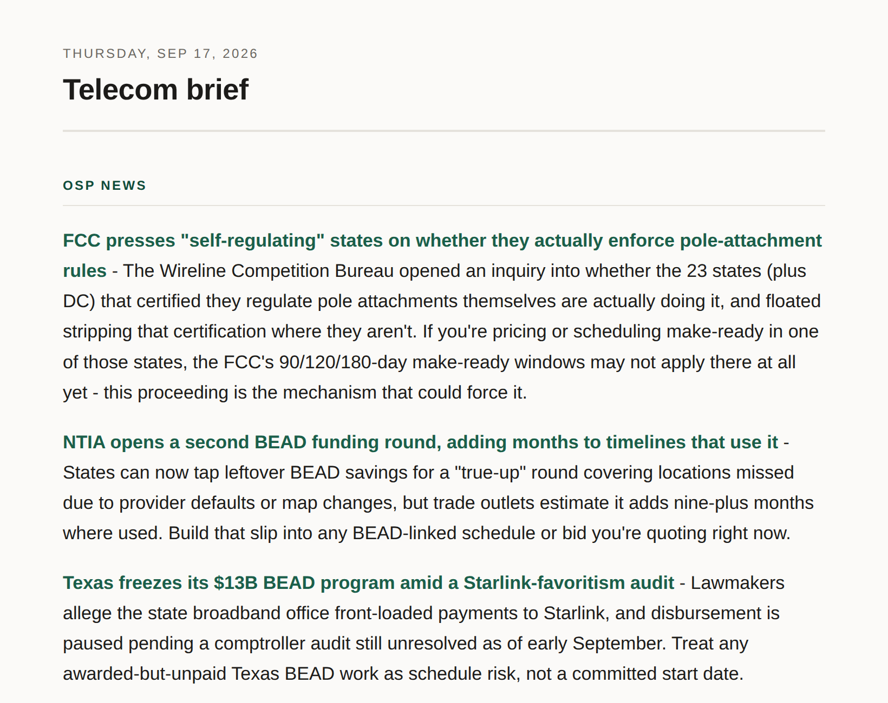

# Daily morning brief

**Pick your topics. Every morning it researches them, skips anything it already
told you, and puts a short brief on your phone while you sleep.**



No API key, no code, no terminal. Setup is about ten minutes in a browser, and
the research runs on the Claude subscription you already have.

**[See a real brief →](example-brief.md)**

**[The same format in four other fields →](example-brief-2.md)**

---

<details open>
<summary><h3>Quick start</h3> - three steps, about ten minutes</summary>

**1. Make your own copy.** Click **Use this template** → **Create a new
repository** at the top of this page. Private is fine.

**2. Open it in Claude.** Go to **[claude.ai/code](https://claude.ai/code)**,
start a session on your new repository, and type `/setup`.

**3. Answer seven questions.** What you do, what is already on your radar, where
you are headed, and what you want tracked. Plain language, and **you do not need
to name a single website**:

> *"AT&T and Verizon fiber buildouts, BEAD funding news, copper retirement,
> supply chain and manufacturing - Corning, Prysmian - competitor activity,
> FCC policy."*

It goes and finds the sources for you, opens each one to confirm it is live and
readable, writes your beat files, and hands you a short list of things to click.

Next morning, your phone buzzes.

> **Want the manual path, or to see what you are agreeing to first?**
> **[SETUP.md](SETUP.md)** is every click, every setting, the seven questions in
> full, and what to do when something breaks. You do not need it to start.

</details>

<details>
<summary><h3>What you need</h3> - a Claude plan, a free GitHub account, ~$5 for notifications</summary>

| | |
|---|---|
| **Claude Pro or Max** | The daily run is an ordinary Claude Code session |
| **GitHub account** | Free. Private repository is fine |
| **Notifications** | **Pushover** recommended: ~$5 once on Android or iOS, arrives every morning. The routine's own push and email is free but best-effort, so test it on day one |
| **Cloudflare** | Free, and genuinely optional. Skip it and briefs still land in your repository as markdown |

**Running cost: nothing.** There is no API key anywhere in this project. One
thing to check during setup: turn *off* usage credits at
claude.ai/settings/usage, so hitting your plan limit skips a run rather than
billing you.

</details>

<details>
<summary><h3>Why not just ask Claude to do this every morning?</h3> - the honest answer</summary>

Fair question, and for some people the honest answer is that you should. A
routine that says "search these topics and tell me what's new" takes two minutes
to build and it will work. Here is what it will not do.

**It repeats itself.** A scheduled run happens in a container that is destroyed
when it finishes, so nothing survives until tomorrow. By day three it is telling
you day one's stories. `covered.json` is a ledger of every item ever reported,
and every beat reads it before searching. That one file is most of the
difference between a brief you keep opening and one you quietly stop opening.

**It invents things.** A model summarizing search results will write confident
items from snippets, with wrong dates and links that go nowhere. The beats here
must open every page before reporting it, and must drop and disclose anything
they cannot read.

**It forgets who you are.** A "why it matters" line is only worth reading when
it is written against your job and where you are trying to get to. That context
lives permanently in the beat files instead of being re-explained every morning.

**It has nowhere to put anything.** No archive you can search in six months, no
page for your phone, nothing to hand a colleague.

**Where the simple version wins:** if you want a loose sense of a field and do
not mind repeats, a bare routine is genuinely enough. What is here starts paying
for itself when you want to read this every morning for months and trust it.

</details>

<details>
<summary><h3>How it works</h3> - parallel research agents, one ledger, one page</summary>

Two to five research agents each cover a "beat." They run in parallel, each
reading the ledger first so nothing repeats, and their findings get merged,
de-duplicated across beats, ranked, and written up as short paragraphs.

```
6:00am  Scheduled run starts on its own (your devices can be off)
          |
          +-- beat 1 ....... your topics
          +-- beat 2 ....... your topics
          +-- beat 3 ....... your topics
          +-- beat 4 ....... your topics
          |
          v
        merge, drop cross-beat duplicates, rank
          |
          +--> briefs/YYYY-MM-DD.md ... markdown archive
          +--> covered.json ........... so nothing repeats
          +--> site/ .................. optional website
          |
          v
        notification --> push or email, with a link
```

Briefs are committed to your repository as markdown, which GitHub renders fine
on a phone. That alone is a complete working system. The website is an upgrade,
about five extra minutes on Cloudflare's free tier, and setup will ask.

</details>

<details>
<summary><h3>The beats that ship are examples</h3> - yours replace them</summary>

`.claude/agents/` ships with four beats tuned for outside plant fiber design and
QC: industry news, market forces, professional development, and quality
practice. They are there so you can see what a well-specified beat looks like,
and `/setup` deletes them and writes yours.

The topics are genuinely yours. Fiber buildouts and BEAD funding, or cap rates
and zoning, or data center siting and power contracts, or the certification
deadlines in whatever field you actually work in.

[`examples/beats/`](examples/beats/) carries the same structure written for
commercial real estate underwriting and for data center siting, with nothing to
do with fiber, so you can see the scaffolding survive leaving telecom.

Prefer to do it by hand? They are plain markdown. Copy one, rewrite the scope
and sources, then add it to the spawn list and section order in
`.claude/commands/brief.md`.

</details>

<details>
<summary><h3>Design decisions worth keeping</h3> - what came out of running it</summary>

**Open the page or drop the item.** An agent must actually fetch a page before
reporting it. If the fetch fails, blocked or paywalled or gone, the item is
dropped and reported, never written up from search results. Without this you get
plausible-looking items assembled from snippets, with wrong dates and dead
sources. This is the most important rule here.

**"Nothing new" is a valid answer.** A beat with nothing worth reporting says so
rather than padding. A brief you trust to be empty on a quiet day is worth more
than one that always finds five things.

**Agents can't write files.** They research and report; the pipeline does the
writing. Read-only agents can't corrupt your archive or your ledger.

**Range across sources.** If most items come from one outlet, the agent searched
one site instead of working a beat. There's an explicit rule against it.

**The ledger is the whole trick.** `covered.json` records every reported item,
and every agent reads it before searching. It's what stops the brief becoming
the same five stories every week.

**Standard library only.** `render.py` and `notify.py` use nothing but Python's
standard library. This runs in a fresh container every morning, and a pipeline
that can't break because a dependency moved is worth more than any convenience a
library would add.

</details>
